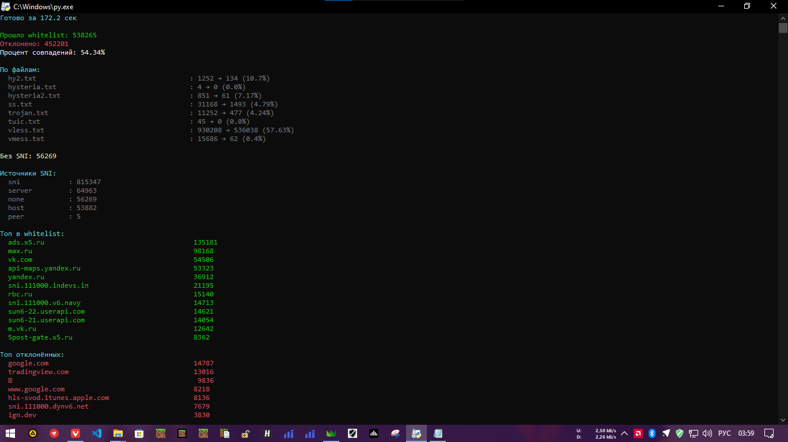
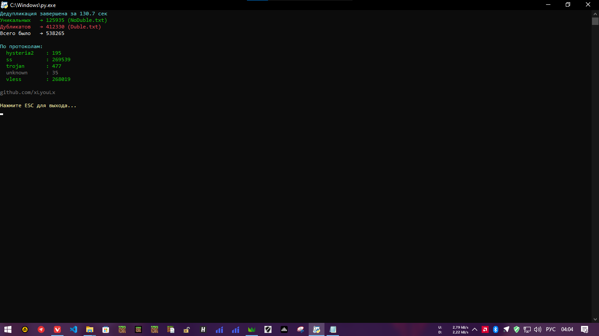

# SNI-sub-filter

Фильтрует ссылки vless/vmess/trojan/ss/hysteria2/tuic по SNI/host, оставляя только те, чей домен совпадает с твоим белым списком.




---

## Что умеет

- Рекурсивно обходит папку `sub` и подпапки, берёт все `.txt` файлы
- Вытаскивает ссылки даже если они склеены в строку через пробелы или кавычки
- Поддерживаемые протоколы:
  - `vless://`
  - `vmess://`
  - `trojan://`
  - `ss://`
  - `hysteria2://` / `hy2://` / `hysteria://`
  - `tuic://`
- Извлекает SNI из параметров `sni=`, `host=`, `servername=`, `peer=` (плюс reality host)
- Сравнивает с доменами из `whitelist.txt` (точное совпадение или поддомен)
- Прошедшие фильтр - в `subWhitelist.txt`
- Отфильтрованные - в `subNo.txt`
- Старые версии файлов сохраняются с датой в папку `backups/`
- По кнопке `Y` запускается умная дедупликация по ключам (сервер+порт+uuid+и т.д.)
  - Уникальные → `NoDuble.txt`
  - Дубликаты → `Duble.txt`
- Цветная статистика с топами принятых и отброшенных доменов

---

## Как пользоваться?

1. Положи все свои ключи в папку `sub/` (можно с подпапками, главное расширение файла .txt)

```sub.txt пример файла
sub.txt пример файла
vless://XXXXX-XXXX-XXXXXX....
vless://XXXXX-XXXX-XXXXXX....
vmess://XXXXX-XXXX-XXXXXX....
ss://XXXXX-XXXX-XXXXXX....
```

2. Создай `whitelist.txt` со своими доменами (по одному на строку)

```whitelist.txt пример
whitelist.txt пример
vk.com
yandex.ru
ozon.ru
mail.ru
```

3. Запускай

```bash
python Sni_filter.py
```

---

## Что нового (2026.04.24)

TUIC/SS/HY2/HY протокол (парсинг + ключ для дедупликации)
Hysteria: поддержка hysteria://, hysteria2://, hy2://
Shadowsocks: поддержка ss://
Tuic: поддержка tuic://
Результат дедупликации: NoDuble.txt (уникальные), Duble.txt (дубликаты)
Реальная дедубликация всех протоколов:
vless:// → ключ: server:port:security:flow:pbk|sid|sni
vmess:// → ключ: server:port:uuid:security:net:type:host:path
trojan:// → ключ: server:port:password:security:type:host:path:sni
ss:// → ключ: server:port:method:password
hysteria2:// → ключ: server:port:sni
tuic:// → ключ: server:port:uuid:password:security:alpn:sni

Оптимизация: Автосохранение промежуточных результатов каждые 60 секунд
Оптимизация: быстрая обработка: 900к ссылок за ~170 секунд

## Чем мой дедубликатор отличается от других?

Другие авторы обычно сравнивают строки целиком, если совпали - дубль. Или собирают ключ из uuid:server:port:security:flow:pbk|sid|sni и всего подряд, что приводит к ложным дублям.
Это ошибка. UUID у каждой ссылки свой, он просто идентификатор ключа, а не его суть. Название (тег) тоже не имеет значения для дедупликации.

Как делаю я (на примере vless):
Беру только важное: server, port, security, flow, а для reality ещё pbk, sid, sni
UUID игнорирую. Тег игнорирую. Порядок параметров в ссылке не важен.
Две ссылки с разными UUID, разными тегами, но на один сервер с одинаковыми настройками - будут признаны дубликатами. И это правильно.

---

## 🇬🇧 English version

<details>
<summary>Click for English</summary>

```markdown
# SNI-sub-filter

Filters vless/vmess/trojan/ss/hysteria2/tuic links by SNI/host. Keeps only those whose domain matches your whitelist.


---

## Features

- Recursively scans `sub/` folder and subfolders, grabs all `.txt` files
- Extracts links even if they are glued together with spaces or quotes
- Supported protocols:
  - `vless://`
  - `vmess://`
  - `trojan://`
  - `ss://`
  - `hysteria2://` / `hy2://` / `hysteria://`
  - `tuic://`
- Extracts SNI from parameters `sni=`, `host=`, `servername=`, `peer=` (plus reality host)
- Compares against domains from `whitelist.txt` (exact match or subdomain)
- Passed filter → `subWhitelist.txt`
- Rejected → `subNo.txt`
- Old file versions are saved with timestamp in `backups/` folder
- Press `Y` to run smart deduplication using keys (server+port+uuid+etc)
  - Unique → `NoDuble.txt`
  - Duplicates → `Duble.txt`
- Colored statistics with top accepted and rejected domains

---

## How to use

1. Put your configs in `sub/` folder (subfolders allowed, files must have .txt extension)

```
sub.txt example
vless://XXXXX-XXXX-XXXXXX....
vless://XXXXX-XXXX-XXXXXX....
vmess://XXXXX-XXXX-XXXXXX....
ss://XXXXX-XXXX-XXXXXX....
```

2. Create `whitelist.txt` with your domains (one per line)

```
whitelist.txt example
vk.com
yandex.ru
ozon.ru
mail.ru
```

3. Run

```bash
python Sni_filter.py
```

---

## What's new (2026.04.24)

TUIC/SS/HY2/HY protocol (parsing + dedup key)
Hysteria: supports hysteria://, hysteria2://, hy2://
Shadowsocks: supports ss://
Tuic: supports tuic://
Deduplication output: NoDuble.txt (unique), Duble.txt (duplicates)
Real deduplication for all protocols:
vless:// → key: server:port:security:flow:pbk|sid|sni
vmess:// → key: server:port:uuid:security:net:type:host:path
trojan:// → key: server:port:password:security:type:host:path:sni
ss:// → key: server:port:method:password
hysteria2:// → key: server:port:sni
tuic:// → key: server:port:uuid:password:security:alpn:sni

Optimization: Auto-save intermediate results every 60 seconds
Optimization: Fast processing: 900k links in ~170 seconds

## How is my deduplicator different from others?

Other authors usually compare strings as a whole - if they match, it's a duplicate. Or they build a key from uuid:server:port:security:flow:pbk|sid|sni and everything else, which leads to false duplicates.

This is wrong. UUID is different for every link, it's just an identifier, not the essence of the config. The name (tag) also doesn't matter for deduplication.

How I do it (using vless as an example):
I only take what matters: server, port, security, flow, and for reality also pbk, sid, sni.
I ignore UUID. I ignore tag. Parameter order doesn't matter.

Two links with different UUIDs, different tags, but pointing to the same server with the same settings - will be recognized as duplicates. And that's correct.

</details>
```
